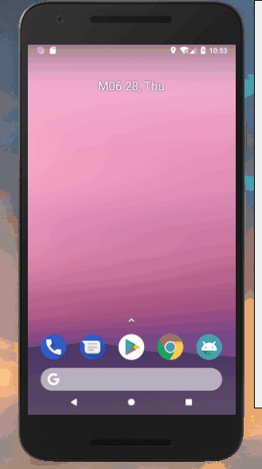

# MarqueeView
新的里程表式垂直跑马灯，基于viewgroup的自定义控件

## 效果图


## 用法：
### Step 1. 将JitPack添加到项目中:

```groovy
    allprojects {
		repositories {
			...
			maven { url 'https://jitpack.io' }
		}
	}
```
	
### Step 2. 添加依赖
```groovy
	dependencies {
	        implementation 'com.github.nelson1110:MarqueeView:0.1.0-release'
	}
```
### Step 3. 在xml中添加该控件
```xml
<com.libs.nelson.marqueeviewlib.MarqueeView
        android:layout_width="match_parent"
        android:layout_height="wrap_content"
        />
```
 `xml`中的一些可用属性
 
| 参数名 | 意义 | 
| - | - |
| orientation | 动画滚动方向|
| animator_duration | 动画时间 |
| stay_duration | 每个item动画结束后停留的时间 |
| reverse_animator | 是否反向动画，默认↑或← |

### Step 4. 给`MarqueeView`设置`Adapter`
```kotlin
marqueeView.setAdapter(object : MarqueeView.MarqueeViewAdapter(){
            override fun getItemLayout(): Int {

                return R.layout.layout
            }

            override fun onBindItemView(itemView: View, position: Int) {
              itemView.findViewById<TextView>(R.id.text).text = position.toString()

            }

            override fun getItemCount(): Int {
                return 4
            }

        })
```
`Adapter`中各方法的含义：

| 方法名 | 意义 | 
| - | - |
| getItemLayout | 决定滚动的内容的布局，当前版本默认内容布局只有一种|
| onBindItemView | 给当前position的内容布局绑定数据 |
| getItemCount | 决定内容item有多少个 |

License
-------

Copyright 2018 Nelson1110

Licensed to the Apache Software Foundation (ASF) under one or more contributor
license agreements.  See the NOTICE file distributed with this work for
additional information regarding copyright ownership.  The ASF licenses this
file to you under the Apache License, Version 2.0 (the "License"); you may not
use this file except in compliance with the License.  You may obtain a copy of
the License at

http://www.apache.org/licenses/LICENSE-2.0

Unless required by applicable law or agreed to in writing, software
distributed under the License is distributed on an "AS IS" BASIS, WITHOUT
WARRANTIES OR CONDITIONS OF ANY KIND, either express or implied.  See the
License for the specific language governing permissions and limitations under
the License.
